# DevSecOps Capstone Project – Secure Upload Server

## 📌 Project Overview

This capstone project demonstrates a **robust DevSecOps CI pipeline** for a Flask-based file upload application. The goal is to integrate security **early and continuously** across the software development lifecycle (SDLC) using industry-standard tools, while maintaining **developer control over remediation**.

The pipeline focuses on **detection, visibility, and informed decision-making**, rather than risky auto-remediation.

---

## 🏗️ System Architecture

```mermaid
graph TD
    Dev[Developer] -->|Git Push / PR| GitHub[GitHub Repository]
    GitHub -->|Trigger| GA[GitHub Actions CI]

    GA --> SCA[Snyk – Dependency Scan]
    GA --> SAST[SonarCloud – Static Analysis]
    GA --> FS[Trivy – Filesystem Scan]
    GA --> IMG[Trivy – Docker Image Scan]
    GA --> DAST[OWASP ZAP – DAST]

    DAST --> App[Upload Server Container]

    SCA --> Reports[Security Reports]
    SAST --> Reports
    FS --> Reports
    IMG --> Reports
    DAST --> Reports

    Reports --> Artifact[GitHub Artifacts]
```

**Explanation:**

* Developers push code to GitHub
* GitHub Actions triggers the CI pipeline
* Multiple security scanners run in parallel
* Findings are collected as reports
* Reports are uploaded as build artifacts for review

---

## 🔄 CI/CD Pipeline Flow

```mermaid
flowchart LR
    A[Checkout Code]
    B[Install Dependencies]
    C[Snyk – SCA]
    D[Docker Build]
    E[Trivy FS Scan]
    F[Trivy Image Scan]
    G[SonarCloud SAST]
    H[OWASP ZAP DAST]
    I[Generate Consolidated Report]
    J[Upload Artifacts]

    A --> B --> C --> D
    D --> E --> F
    F --> G --> H --> I --> J
```

---

## 🔐 Security Stages & Tool Rationale

### 1️⃣ Software Composition Analysis (SCA) – **Snyk**

* Detects vulnerable third‑party dependencies
* Focuses on supply‑chain security
* Outputs JSON report for traceability

### 2️⃣ Static Application Security Testing (SAST) – **SonarCloud**

* Analyzes source code for bugs, vulnerabilities, and code smells
* Enforces secure coding practices
* Quality Gate intentionally **not enforced** to avoid blocking learning workflows

### 3️⃣ Container & Filesystem Scanning – **Trivy**

* Filesystem scan: identifies vulnerable libraries in repo
* Image scan: detects OS and dependency vulnerabilities in Docker image

### 4️⃣ Dynamic Application Security Testing (DAST) – **OWASP ZAP**

* Runs against a live containerized application
* Detects runtime issues such as injection flaws and misconfigurations

---

## 🚫 Auto-Fix Policy (Design Decision)

This project **intentionally avoids automatic remediation**.

### Why?

* Auto-fixes can introduce breaking changes
* Developers must understand and validate security fixes
* Aligns with real-world enterprise DevSecOps practices

### Implemented Approach:

* Pipeline **detects and reports** issues
* Reports are uploaded as artifacts
* Developers manually review and apply fixes

> "Security is a shared responsibility, not a blind automation task."

---

## 📊 Evidence & Reporting

Each pipeline run produces:

* `snyk.json` – Dependency vulnerabilities
* `trivy-fs.json` – Filesystem scan results
* `trivy-image.json` – Docker image vulnerabilities
* `zap_report.html` – Runtime DAST findings
* Consolidated security summary report

All reports are stored as **GitHub Actions artifacts** for audit and review.

---

## 🧠 Security Maturity Assessment

This project aligns with **DevSecOps Maturity Level 3**:

* Shift-left security
* Automated scanning
* Manual remediation control
* Artifact-based evidence

---

## ⚠️ Risks & Limitations

* Quality Gates are not enforced
* No runtime protection (e.g., WAF, Falco)
* Local DAST environment only

---

## 🔮 Future Enhancements

* Enforced quality gates
* Runtime security monitoring (Falco)
* Policy-as-Code (OPA)
* PR-based auto-remediation suggestions

---

## 🧪 Conclusion

This capstone demonstrates a **realistic, production-aligned DevSecOps pipeline** that balances automation with human oversight, emphasizing learning, accountability, and secure engineering practices.
